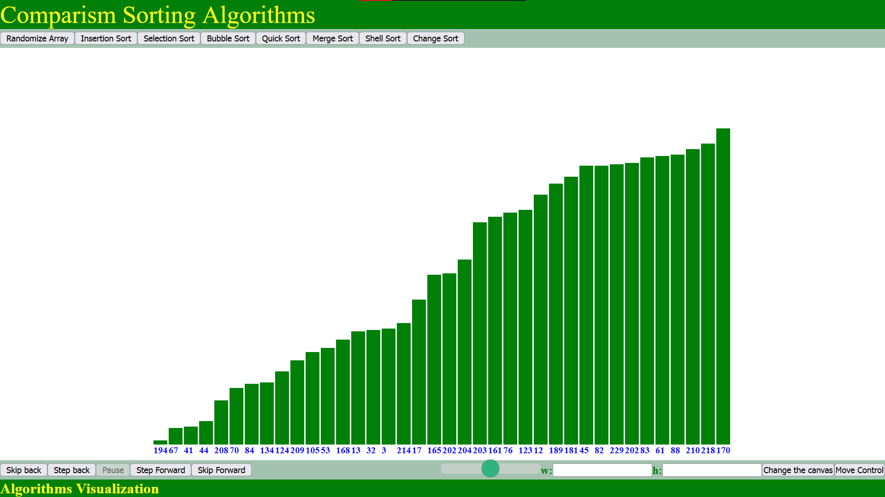

# Sorting-Algorithm-visualizer
This a simple yet one of the best example of how to use native DOM methods using Vanila javascript and create a dynamic data visualizing projects, this is a Sorting algorithms visual application. here a are bunch of sorting algorithms implements using Javascript
# Sorting Algorithm Visualizer

## Overview

The Sorting Algorithm Visualizer is an interactive web application that allows users to visualize various sorting algorithms in action. It provides a dynamic and intuitive way to understand how different sorting algorithms work, aiding in the comprehension of their efficiency and performance characteristics.

## Features

- **Interactive Visualization:** Watch sorting algorithms in real-time, helping you grasp their inner workings visually.
- **Multiple Algorithms:** Choose from a variety of sorting algorithms, including Bubble Sort, Merge Sort, Quick Sort, and more.
- **Customizable Array Size:** Adjust the size of the input array to see how algorithms handle different data sets.
- **Step-by-Step Playback:** Understand each step of the sorting process with a step-by-step playback feature.

## Demo

[Link to live demo or GIF/video showcasing the visualizer in action]

## Getting Started

To run the Sorting Algorithm Visualizer locally, follow these steps:

1. Clone the repository: `git clone https://github.com/your-username/sorting-algorithm-visualizer.git`
2. Navigate to the project directory: `cd sorting-algorithm-visualizer`
3. Open `index.html` in your preferred web browser.

## Technologies Used

- HTML5, CSS3, JavaScript
